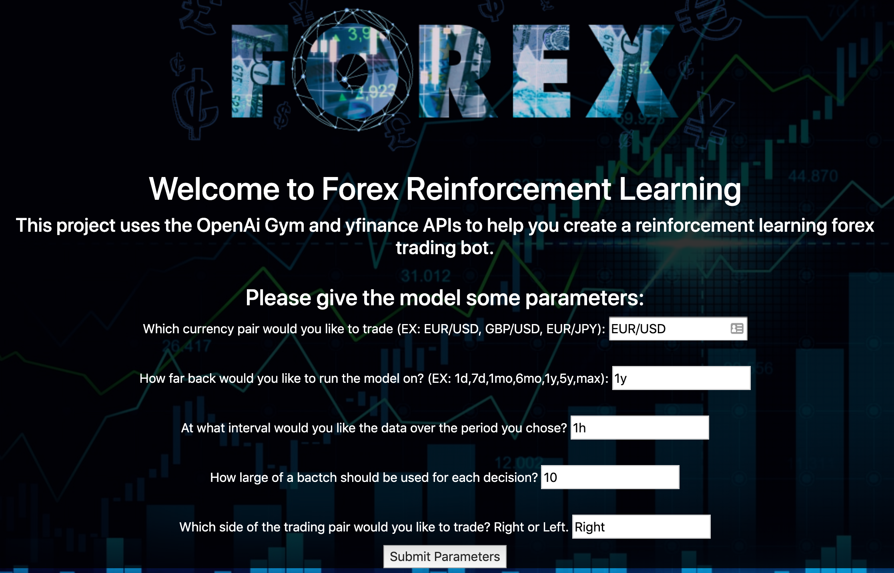

# NW-MSDS-434-fx-rl-project



This is my personal project for Northwestern School of Professional Studies Masters of Data Science's 434 Analytics Application Engineering. 
<br/><br/>
It is a reinforcement learning algorithm based on an implementation OpenAi gym for forex training. It is deployed as a flask app backend with a simple bootstrapped frontend managed via CircleCI and deployed on Google Cloud Platform's AppEngine.

Run locally simply by running from the app/ dir:
<br/>
```pip3 install -r requirements.txt```
<br/>
```python3 main.py```
<br/>
Then navigate to your local host as directed by flask
####Model Parameters:
- currency pair: Trading pair that will be used
	- EUR/USD
	- USD/JPY
	- GBP/USD
	- AUD/USD
	- NZD/USD
	- GBP/JPY
	- EUR/GBP
	- EUR/CAD
	- EUR/SEK
	- EUR/CHF
	- EUR/HUF
	- EUR/JPY
	- USD/CNY
	- USD/HKD
	- USD/SGD
	- USD/INR
	- USD/MXN
	- USD/PHP
	- USD/IDR
	- USD/THB
	- USD/MYR
	- USD/ZAR
	- USD/RUB
	
- period:
	- 1d
	- 5d
	- 1mo
	- 3mo
	- 6mo
	- 1y
	- 2y
	- 5y
	- 10y
	- ytd
	- max
	
-
-


